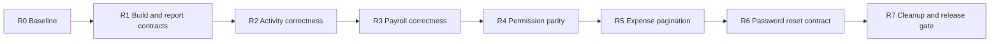

# Gemini Repair Plan — DENTIX Finance V2

## Start Prompt

You are repairing the current uncommitted DENTIX Finance V2 implementation after an independent review found release-blocking defects.

Treat this document as the execution request. Treat `MASTER_SPEC.md`, phase documents, `FINANCE_METRIC_CONTRACT.md`, and the implementation ledger as reference specifications and historical claims, not proof that the implementation is correct.

Do not redesign Finance V2, add Finance V3 capabilities, or perform unrelated refactors. Preserve tenant isolation, existing financial writes, patient data, and the working tree's unrelated user changes. Inspect the real code before editing.

Work through the repair batches below in order. Do not mark a batch VERIFIED until every acceptance criterion and verification command for that batch passes. Do not update `CURRENT_STATE.md`, `IMPLEMENTATION_LEDGER.md`, or `GLOBAL_RELEASE_GATE.md` to claim completion until the final release gate passes.

## Current Independent Evidence

- `npm.cmd test -- --run`: 19 files and 124 tests passed.
- `.venv\Scripts\python.exe -m pytest backend\tests\test_billing_logic.py backend\tests\test_financial_truth.py -q`: 13 tests passed.
- `npm.cmd run build`: FAILED because `useReports.js` imports `getExpenses` from a module that does not export it.
- Existing tests rely heavily on mocked response shapes and do not prove frontend/backend contract compatibility.
- `git diff --check`: failed on trailing blank lines in three changed files.
- `GLOBAL_RELEASE_GATE.md`: still unchecked despite completion claims elsewhere.

## Non-Negotiable Rules

1. Fix root causes; do not weaken, skip, or delete tests to obtain green output.
2. Add contract/integration tests using the actual backend response shapes.
3. Financial formulas and authoritative totals stay in the backend.
4. Do not grant doctors clinic-wide financial access to make a 403 disappear.
5. Every financial query and mutation must remain tenant-scoped.
6. Do not invent invoices, payment methods, doctor settlement history, or ledger entities.
7. Keep API response envelopes consistent with `StandardResponse`.
8. Do not modify unrelated authentication or analytics behavior except for the explicit password-reset regression in this plan.
9. Before every batch, report the files inspected and the exact intended edits. After every batch, report commands and results.
10. PARTIAL is not VERIFIED. A passing unit test suite with a failing production build is not complete.

## Repair Order



## R0 — Preserve and Baseline

### Tasks

- Capture `git status --short --branch` and `git diff --stat`.
- Confirm which changes predate this repair and avoid overwriting them.
- Reproduce the production build failure.
- Run the two currently documented test commands once as a baseline.
- Do not edit completion documents in this batch.

### Exit criteria

- The build failure and current green test counts are recorded.
- No unrelated file has been modified by the repair.

## R1 — Restore Production Build and Real Report Contracts

### Defects to fix

1. `frontend/src/features/finance/reports/hooks/useReports.js` imports `getExpenses` from `@/api/financials`, but it is exported by `@/api/billing`.
2. Comprehensive statistics return nested fields:
   - `income.total_revenue`
   - `income.total_collected`
   - `deductions.expenses`
   - `deductions.lab_costs`
   - `deductions.doctor_dues.total`
   - `deductions.staff_dues.total`
   - `deductions.total_deductions`
   - `net_profit`
   The report UI currently expects unrelated flat fields.
3. `patients-report` returns `total_invoiced`, `total_paid`, `outstanding_balance`, and `all_time_outstanding`; the collections report expects different names and a missing `summary` object.
4. Expenses use `cost` and `notes`; the report expects `amount` and `description`.
5. Collections and expense reports silently truncate at hard-coded limits.

### Implementation requirements

- Import each API function from its real owner.
- Introduce explicit response-to-view-model adapters in the report hook or a focused utility; do not scatter fallback aliases throughout presentation components.
- Make summary, collections, expense-category, provider, and profitability views consume one documented canonical view model each.
- Implement complete report retrieval. Prefer server aggregates and paginated endpoints. If client aggregation is temporarily necessary, fetch all pages safely rather than silently truncating at 100/200 rows.
- Revoke every object URL after CSV download.
- Update CSV export to use the same canonical view models shown onscreen.
- Replace mocked fixtures with fixtures matching actual `StandardResponse` payloads.

### Required tests

- A test that imports/builds `useReports.js` without module mocking hiding missing exports.
- Summary adapter test using the exact `/accounting/comprehensive-stats` response.
- Collections adapter test using the exact `/accounting/patients-report` response.
- Expense report test using `cost` and `notes`.
- Test proving more than one page is included or explicitly paginated without silent truncation.
- CSV test proving exported values match displayed values.

### Exit criteria

- `npm.cmd run build` passes.
- All five report views render non-zero real-contract data where provided.
- No report relies on fields absent from the backend response.

## R2 — Repair Financial Activity

### Defects to fix

- `AccountingService.get_financial_activity()` references nonexistent `Expense.description` and `Expense.amount`; the model fields are `notes` and `cost`.
- Payment filtering compares a `DateTime` column with `date()` values and excludes payments later on the selected end date.
- The service loads every matching record from four tables and paginates only after merging in memory.
- Role/self-scope behavior is not enforced by this service.

### Implementation requirements

- Use `Expense.cost`, `Expense.notes`, and `Expense.item_name` consistently.
- Use an inclusive start and exclusive next-day end boundary for datetime columns.
- Validate bad date input and unsupported activity types with a clear 4xx response; do not silently ignore malformed dates.
- Preserve tenant filters on every source query.
- Enforce the approved financial visibility matrix. A receptionist must not receive clinic-wide expenses/payroll merely because the role can record payments. Doctors must never receive clinic-wide activity.
- Avoid unbounded full-table loading. Implement a bounded merged-query strategy or a defensible per-source bounded fetch with correct totals; document the chosen tradeoff.

### Required backend tests

- Activity containing a manual expense does not crash and returns `cost` as amount and `notes` as subtitle.
- A payment at 15:00 on `end_date` is included.
- Cross-tenant activity is excluded for all four source types.
- Role visibility tests for admin/accountant, receptionist, and doctor.
- Pagination ordering is stable when timestamps are equal.

### Exit criteria

- `/api/v1/accounting/activity` works with payment, expense, lab, and salary records together.
- Date range, search, type filtering, totals, and pagination are proven by backend tests.

## R3 — Make Payroll Semantically Correct

### Defects to fix

- The UI permits completing a partial payment, while the backend rejects every second payment for the same employee/month.
- Salary status collapses records into one payment per user and cannot represent a payment history.
- Payroll includes doctors and admins, while doctor compensation is a separate workflow and `calculate_staff_dues` uses different staff eligibility.
- Overpayment and invalid month/day values are insufficiently guarded.

### Implementation requirements

- Define one shared payroll-eligible role predicate and use it in payroll status and staff-dues logic. Exclude doctors, admins, super admins, patients, and guests. Include only explicitly approved employee roles.
- Support multiple partial payments per employee/month without overwriting history.
- Return explicit backend-owned fields per employee:
  - `payable_amount`
  - `paid_amount`
  - `remaining_amount`
  - `status` (`unpaid`, `partial`, `paid`)
  - `payments` history
- Preserve individual payment IDs so a specific erroneous payment can be deleted and totals recalculated.
- Reject zero/negative payments, overpayment, invalid months, impossible `days_worked`, and users outside the tenant or payroll-eligible roles.
- Update the frontend to use backend totals/status instead of recomputing authoritative payroll state.

### Required tests

- Unpaid -> first partial -> second partial/final -> paid.
- Delete one partial payment and verify remaining balance/status.
- Reject overpayment and non-positive amounts.
- Doctor/admin never appear in payroll.
- Tenant A cannot pay or view Tenant B staff.
- Frontend workflow test using real response fields, not an invented singular `payment` fixture.

### Exit criteria

- The documented “partial payment then full completion” flow passes end to end.
- Payroll totals reconcile exactly with employee rows and the intended overview obligation semantics.

## R4 — Align Frontend and Backend Permissions

### Defects to fix

- The Finance route allows only admin, super admin, accountant, and doctor, excluding receptionist and manager despite backend permissions.
- The route allows doctors into pages whose APIs require `FINANCIAL_READ`, which the doctor role does not have.
- Frontend permission strings use `financial_read`/`FINANCIAL_READ`; backend values are `financial:read`, `financial:write`, and `system:config`.
- Accountant write behavior differs between frontend assumptions, documentation, and backend `ROLE_PERMISSIONS`.

### Implementation requirements

- Make `backend/core/permissions.py` the runtime permission source of truth and reconcile the product matrix explicitly.
- Use canonical permission values with colons in the frontend.
- Do not solve doctor access by granting clinic-wide `FINANCIAL_READ`.
- For doctor self-compensation, either implement a dedicated server-forced self endpoint such as `/accounting/doctor-details/me`, or keep Finance unavailable to doctors until such an endpoint exists. The client must never select an arbitrary doctor ID for self-scope.
- Allow receptionists/managers only into workflows authorized by the agreed matrix. Hide navigation and also enforce the restriction server-side.
- Decide accountant write behavior once, document it, and make frontend and backend identical.
- Add a route-level unauthorized fallback; hiding a navigation item alone is insufficient.

### Required tests

- Route and API matrix tests for super admin, admin, manager, accountant, receptionist, doctor, assistant, and nurse.
- Receptionist can access only approved patient/payment functions.
- Doctor cannot access clinic-wide overview, expenses, payroll, activity, or reports.
- Doctor self-compensation cannot be changed to another doctor through URL manipulation.
- Permission strings are verified against backend enum values.

### Exit criteria

- Every visible action succeeds for its intended role.
- Every hidden/forbidden action returns 403 when called directly.

## R5 — Implement Real Expense Pagination

### Defects to fix

- The backend returns only a list and no total count.
- The frontend reports `totalItems: items.length`, preventing navigation beyond the first page.
- Expense KPI fallbacks sum only the visible page and label it as an all-time/period total.

### Implementation requirements

- Return a paginated contract such as `{items, total, skip, limit}` from the backend while preserving the standard envelope.
- Count with the same tenant, search, category, and date filters as the data query.
- Update every expense consumer to unwrap the new contract.
- Derive KPI totals from backend aggregates, never from the visible page.
- Keep mutation invalidation targeted to expenses, affected overview aggregates, activity, and relevant reports.

### Required tests

- At least 26 expenses produce an enabled second page with page size 25.
- Filtered total count matches filtered rows.
- Page-two navigation is URL-backed and stable on refresh/back.
- KPI totals remain the full filtered-period totals on page two.

### Exit criteria

- All expense pages are reachable and totals do not change merely because the user changes page.

## R6 — Repair Password Reset Contract Regression

### Defect to fix

The backend changed forgot/reset endpoints from query parameters to JSON bodies, but `frontend/src/api/auth.js` still sends query parameters.

### Implementation requirements

- Keep sensitive reset tokens and new passwords out of URLs and access logs.
- Update the frontend client to send JSON bodies matching `ForgotPasswordRequest` and `ResetPasswordRequest`.
- Correctly unwrap `StandardResponse` in Forgot/Reset pages.
- Preserve generic forgot-password responses to avoid account enumeration.
- Preserve token hashing, expiry, single use, and previous-token invalidation.
- Align frontend password validation with backend minimum and maximum rules.

### Required tests

- Forgot-password request body contract.
- Reset-password request body contract.
- Valid token, invalid token, expired token, reused token.
- Password validation parity, including the 72-character maximum.
- No token or password appears in the request URL.

### Exit criteria

- The complete forgot -> verify -> reset -> login flow passes.

## R7 — Remove False Completion Evidence and Pass the Release Gate

### Tasks

- Remove the 15 dead accounting/journal API methods documented in `FINANCE_METRIC_CONTRACT.md` if repository search proves they have no consumers.
- Fix `git diff --check` failures without reformatting unrelated files.
- Add missing contract, API, RBAC, payroll, activity, and pagination tests created by this repair.
- Run the complete verification matrix below.
- Manually audit desktop/mobile and Arabic/English for the changed Finance workflows.
- Only after all gates pass:
  - update `IMPLEMENTATION_LEDGER.md` with exact commands and test names;
  - update `CURRENT_STATE.md` with truthful counts;
  - check applicable items in `GLOBAL_RELEASE_GATE.md` with evidence;
  - leave any unproven item unchecked and mark the overall state PARTIAL/BLOCKED rather than VERIFIED.

## Final Verification Matrix

Run from the repository root unless a working directory is stated.

```powershell
git diff --check
```

```powershell
Set-Location frontend
npm.cmd test -- --run
npm.cmd run build
```

```powershell
Set-Location ..
.\.venv\Scripts\python.exe -m pytest backend\tests\test_billing_logic.py backend\tests\test_financial_truth.py -q
```

Also run every new targeted backend/API test added for:

- report contracts;
- financial activity;
- payroll partial payments;
- Finance RBAC and self-scope;
- expense pagination;
- password reset.

If feasible in the available environment, run the broader affected frontend and backend suites. A test failure must be fixed or explicitly reported; never hide it by narrowing the final command.

## Manual Acceptance Scenarios

1. Production frontend loads `/finance/overview` without console/module errors.
2. Summary report values match the comprehensive-stats API response.
3. Collections report shows real period totals and all-time debt.
4. Expense report displays real records and includes more than the first page.
5. Activity feed renders all four event types and includes end-date transactions.
6. Record two payroll installments and reach a paid status without deleting the first installment.
7. Receptionist, accountant, doctor, and admin each see exactly their permitted routes/actions.
8. Doctor URL manipulation cannot reveal another doctor's compensation.
9. Expense page can navigate from page 1 to page 2.
10. Forgot-password and reset-password complete without query-string secrets or 422 errors.

## Required Final Response From Gemini

Return all of the following:

1. Files changed, grouped by repair batch.
2. Root cause and resolution for every defect in R1–R6.
3. Tests added, with what each test proves.
4. Exact verification commands and complete pass/fail counts.
5. Production build result.
6. Remaining blockers or unchecked release-gate items.
7. `git status --short` at handoff.

Do not use “DONE”, “COMPLETE”, “FINISHED”, or mark phases VERIFIED if the production build fails, any required test fails, any acceptance scenario is unproven, or any applicable release-gate item remains unchecked.
