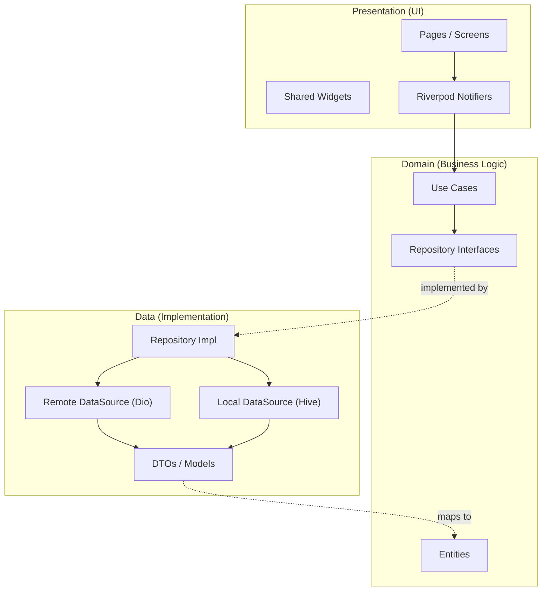
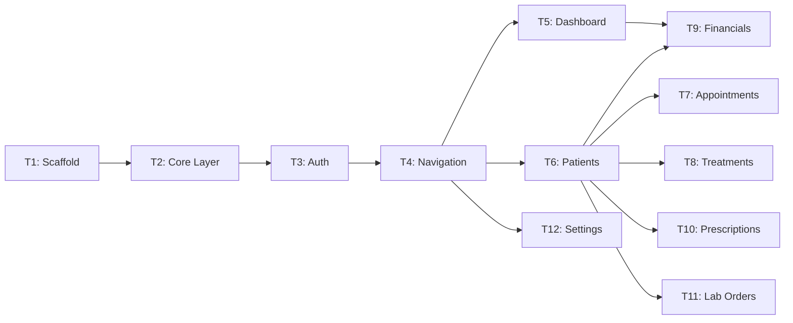

# PLAN: Dentix Mobile (Flutter)

## Overview

**Project Type:** MOBILE
**Primary Agent:** `mobile-developer`
**Framework:** Flutter (Dart)

Build a native mobile app for **Dentix** dental clinic management, connecting to the existing **FastAPI** backend (`/api/v1/`). The app targets **doctors and clinic staff** managing appointments, patients, treatments, financials, and inventory on the go.

---

## Success Criteria

| # | Criterion | Measurement |
|---|-----------|-------------|
| 1 | Login & JWT token lifecycle works | Login → Dashboard in < 2s, auto-refresh on 401 |
| 2 | Patient CRUD functional | Create, search, view profile with history |
| 3 | Appointment calendar works | Month/week view, create/edit/cancel appointments |
| 4 | Financial overview accessible | Dashboard stats match web app values |
| 5 | RTL Arabic UI renders correctly | All screens look correct in AR locale |
| 6 | App starts in < 3s on mid-range device | Cold start measured on Android emulator |
| 7 | Offline graceful degradation | Cached data shown when network lost, no crash |

---

## Tech Stack

| Layer | Choice | Rationale |
|-------|--------|-----------|
| Framework | **Flutter 3.x** | Cross-platform, pixel-perfect UI, strong community |
| State | **Riverpod** | Compile-safe, no context dependency, async-first |
| Network | **Dio** | Interceptors for auth, retry, caching |
| Navigation | **GoRouter** | Declarative, deep-link ready |
| Local Storage | **Hive** | Fast NoSQL for caching, lightweight |
| Secure Storage | **flutter_secure_storage** | Keychain/Keystore for tokens |
| UI Toolkit | **Material 3** | Matches web app aesthetics |
| i18n | **flutter_localizations + intl** | Arabic RTL + English |
| Calendar | **table_calendar** | Mature, customizable |
| Images | **cached_network_image** | Disk-cached X-ray/attachment loading |

---

## Architecture: Clean Architecture



### Scalability & Refactoring Guarantees

| Scenario | What Changes | What Stays |
|----------|-------------|------------|
| API version upgrade | `Remote DataSource` only | Domain + UI |
| Add offline sync | `Repository Impl` adds local fallback | Domain + UI |
| Complete UI redesign | `Presentation` folder only | Domain + Data |
| Switch state management | `Controllers` only | Domain + Data |
| Add new feature (e.g., Insurance) | New feature folder across all 3 layers | Existing features |

---

## File Structure

```
dentix_mobile/
├── lib/
│   ├── main.dart
│   ├── app.dart                           # MaterialApp + GoRouter + Theme
│   ├── core/
│   │   ├── constants/
│   │   │   ├── api_endpoints.dart         # All /api/v1/* paths
│   │   │   └── app_constants.dart         # Colors, sizes, durations
│   │   ├── error/
│   │   │   ├── failures.dart              # ServerFailure, CacheFailure, etc.
│   │   │   └── exceptions.dart            # ServerException, CacheException
│   │   ├── network/
│   │   │   ├── dio_client.dart            # Singleton Dio with base config
│   │   │   ├── auth_interceptor.dart      # Attach token, handle 401 refresh
│   │   │   └── retry_interceptor.dart     # Network retry logic
│   │   ├── theme/
│   │   │   ├── app_theme.dart             # Light + Dark themes
│   │   │   └── app_colors.dart            # Brand colors from web app
│   │   ├── router/
│   │   │   └── app_router.dart            # GoRouter with guards
│   │   ├── l10n/                          # Localization
│   │   │   ├── app_ar.arb                 # Arabic strings
│   │   │   └── app_en.arb                 # English strings
│   │   └── utils/
│   │       ├── date_utils.dart
│   │       └── validators.dart
│   │
│   ├── features/
│   │   ├── auth/
│   │   │   ├── data/
│   │   │   │   ├── models/                # TokenModel, UserModel (fromJson)
│   │   │   │   ├── datasources/           # AuthRemoteSource (POST /auth/login)
│   │   │   │   └── repositories/          # AuthRepositoryImpl
│   │   │   ├── domain/
│   │   │   │   ├── entities/              # UserEntity, TokenEntity
│   │   │   │   ├── repositories/          # AuthRepository (abstract)
│   │   │   │   └── usecases/              # LoginUseCase, LogoutUseCase
│   │   │   └── presentation/
│   │   │       ├── controllers/           # AuthNotifier (Riverpod)
│   │   │       └── pages/                 # LoginPage, SplashPage
│   │   │
│   │   ├── dashboard/
│   │   │   ├── data/                      # DashboardRemoteSource (GET /stats/dashboard)
│   │   │   ├── domain/                    # DashboardStatsEntity, GetDashboardStatsUseCase
│   │   │   └── presentation/
│   │   │       ├── widgets/               # StatCard, RevenueChart, UpcomingAppointments
│   │   │       └── pages/                 # DashboardPage
│   │   │
│   │   ├── patients/
│   │   │   ├── data/                      # PatientRemoteSource (GET/POST/PUT /patients)
│   │   │   ├── domain/                    # PatientEntity, SearchPatientsUseCase
│   │   │   └── presentation/
│   │   │       ├── widgets/               # PatientCard, PatientSearchBar
│   │   │       └── pages/                 # PatientListPage, PatientDetailPage
│   │   │
│   │   ├── appointments/
│   │   │   ├── data/                      # AppointmentRemoteSource (CRUD /appointments)
│   │   │   ├── domain/                    # AppointmentEntity, CreateAppointmentUseCase
│   │   │   └── presentation/
│   │   │       ├── widgets/               # CalendarWidget, AppointmentCard
│   │   │       └── pages/                 # AppointmentCalendarPage, AddAppointmentPage
│   │   │
│   │   ├── treatments/
│   │   │   ├── data/                      # GET/POST /treatments
│   │   │   ├── domain/                    # TreatmentEntity (tooth, procedure, cost)
│   │   │   └── presentation/             # TreatmentHistoryList, AddTreatmentForm
│   │   │
│   │   ├── financials/
│   │   │   ├── data/                      # GET /stats/finance, POST /payments
│   │   │   ├── domain/                    # PaymentEntity, FinancialStatsEntity
│   │   │   └── presentation/             # FinancialDashboard, RecordPaymentSheet
│   │   │
│   │   ├── prescriptions/
│   │   │   ├── data/                      # GET/POST /prescriptions
│   │   │   ├── domain/                    # PrescriptionEntity
│   │   │   └── presentation/             # PrescriptionListPage, CreatePrescriptionPage
│   │   │
│   │   ├── lab_orders/
│   │   │   ├── data/                      # GET/POST /lab-orders
│   │   │   ├── domain/                    # LabOrderEntity (work_type, shade, status)
│   │   │   └── presentation/             # LabOrderListPage, LabOrderStatusTracker
│   │   │
│   │   └── settings/
│   │       └── presentation/             # SettingsPage (language, theme, account)
│   │
│   └── shared/
│       └── widgets/                       # AppButton, AppTextField, EmptyState, ErrorRetryWidget
│
├── test/
│   ├── unit/                              # UseCases, Models (fromJson)
│   ├── widget/                            # Key widgets (LoginPage, PatientCard)
│   └── integration/                       # Full login→dashboard flow
│
├── pubspec.yaml
├── l10n.yaml
└── analysis_options.yaml
```

---

## Backend API Endpoint Map

All endpoints are prefixed with `/api/v1/`.

| Module | Method | Endpoint | Mobile Usage |
|--------|--------|----------|--------------|
| **Auth** | POST | `/auth/login` | Login (email + password → JWT) |
| **Auth** | POST | `/auth/refresh` | Refresh expired access token |
| **Users** | GET | `/users/me` | Get current user profile |
| **Dashboard** | GET | `/stats/dashboard` | Home screen stats |
| **Dashboard** | GET | `/stats/finance` | Financial summary |
| **Patients** | GET | `/patients` | List + search (query params) |
| **Patients** | POST | `/patients` | Create new patient |
| **Patients** | GET | `/patients/{id}` | Patient detail |
| **Patients** | PUT | `/patients/{id}` | Update patient |
| **Appointments** | GET | `/appointments` | List by date range |
| **Appointments** | POST | `/appointments` | Create appointment |
| **Appointments** | PUT | `/appointments/{id}` | Reschedule/update |
| **Appointments** | DELETE | `/appointments/{id}` | Cancel |
| **Treatments** | GET | `/treatments/{patient_id}` | Treatment history |
| **Treatments** | POST | `/treatments` | Record treatment |
| **Payments** | GET | `/payments` | Payment history |
| **Payments** | POST | `/payments` | Record payment |
| **Prescriptions** | GET | `/prescriptions` | List prescriptions |
| **Prescriptions** | POST | `/prescriptions` | Create prescription |
| **Lab Orders** | GET | `/lab-orders` | Track lab orders |
| **Notifications** | GET | `/notifications` | Notification list |
| **Procedures** | GET | `/procedures` | Available procedures list |

---

## Module Construction: Detailed Contents

### 🔐 Auth Module
| Component | File | Details |
|-----------|------|---------|
| **DTO** | `token_model.dart` | `access_token`, `refresh_token`, `role`, `username` |
| **DTO** | `user_model.dart` | `id`, `username`, `email`, `role`, `tenant_id`, `is_2fa_enabled` |
| **Entity** | `user_entity.dart` | Business object (no JSON logic) |
| **DataSource** | `auth_remote.dart` | `login(email, pass)`, `refreshToken(refresh)` |
| **Repository** | `auth_repo_impl.dart` | Stores tokens in SecureStorage, exposes `isLoggedIn` |
| **UseCase** | `login_usecase.dart` | Validates input → calls repo → returns Either<Failure, User> |
| **Controller** | `auth_notifier.dart` | `AsyncNotifier` managing AuthState (loading/success/error) |
| **UI** | `login_page.dart` | Form with email/password, RTL-aware layout |
| **UI** | `splash_page.dart` | Auto-login check, animated logo |

### 📊 Dashboard Module
| Component | File | Details |
|-----------|------|---------|
| **DTO** | `dashboard_stats_model.dart` | Maps `DashboardStats`: patients, revenue, appointments |
| **Entity** | `dashboard_entity.dart` | `totalPatients`, `todayAppointments`, `todayRevenue` |
| **Widget** | `stat_card.dart` | Animated counter card (icon + value + label) |
| **Widget** | `revenue_chart.dart` | Mini bar chart using `fl_chart` |
| **Widget** | `upcoming_list.dart` | Horizontal scrollable appointment cards |

### 🏥 Patient Module
| Component | File | Details |
|-----------|------|---------|
| **DTO** | `patient_model.dart` | Full: `name`, `phone`, `age`, `gender`, `medical_history`, `assigned_doctor_id` |
| **Entity** | `patient_entity.dart` | Clean business object |
| **DataSource** | `patient_remote.dart` | `getAll(page, search)`, `getById(id)`, `create()`, `update()` |
| **UseCase** | `search_patients.dart` | Debounced search with 300ms delay |
| **Controller** | `patient_list_notifier.dart` | Infinite scroll pagination provider |
| **UI** | `patient_list_page.dart` | Search bar + lazy list + FAB to add |
| **UI** | `patient_detail_page.dart` | Tabs: Info, Treatments, Lab Orders, Files |

### 📅 Appointment Module
| Component | File | Details |
|-----------|------|---------|
| **DTO** | `appointment_model.dart` | `patient_id`, `date_time`, `status`, `notes`, `doctor_id` |
| **Entity** | `appointment_entity.dart` | Clean object with computed `isToday`, `isPast` |
| **Widget** | `calendar_widget.dart` | `table_calendar` wrapper with color-coded dots |
| **Widget** | `appointment_card.dart` | Patient name, time, status badge, quick actions |
| **UI** | `calendar_page.dart` | Month view → tap day → see agenda |
| **UI** | `add_appointment_page.dart` | Patient picker, date/time, procedure selector |

### 💰 Financial Module
| Component | File | Details |
|-----------|------|---------|
| **DTO** | `financial_stats_model.dart` | `total_revenue`, `total_received`, `outstanding`, `net_profit` |
| **DTO** | `payment_model.dart` | `patient_id`, `amount`, `date`, `notes` |
| **UI** | `financial_dashboard.dart` | Stat cards + revenue chart |
| **UI** | `record_payment_sheet.dart` | Bottom sheet for quick payment recording |

### 💊 Prescription Module
| Component | File | Details |
|-----------|------|---------|
| **DTO** | `prescription_model.dart` | `patient_id`, `medications`, `notes`, `date` |
| **UI** | `create_prescription.dart` | Medication selector from saved medications |

### 🦷 Lab Orders Module
| Component | File | Details |
|-----------|------|---------|
| **DTO** | `lab_order_model.dart` | `work_type`, `shade`, `material`, `status`, `delivery_date` |
| **UI** | `lab_order_tracker.dart` | Status pipeline: Pending → In Progress → Delivered |

---

## RTL & i18n Strategy

- **Arabic-first**: Default locale is `ar`, with `en` as secondary.
- **Flutter Intl**: Use `.arb` files for all user-facing strings.
- **Directionality**: `Directionality` widget wraps app based on locale.
- **Layout**: Use `start`/`end` instead of `left`/`right` for all padding/margins.
- **Calendar**: Arabic day/month names via `intl` package.
- **Number formatting**: Arabic numerals option via `NumberFormat`.

---

## Security Strategy

| Concern | Solution |
|---------|----------|
| Token storage | `flutter_secure_storage` (Keychain iOS / Keystore Android) |
| API tokens in memory | Never stored in plain SharedPreferences |
| Network security | HTTPS enforced, certificate pinning in production |
| Session timeout | Auto-logout after 30min inactivity |
| Data at rest | No sensitive medical data cached locally (only IDs + names) |
| Logging | No PII in logs (Rule 8 from AI Logging Rules) |

---

## Risk Assessment

| Risk | Impact | Mitigation |
|------|--------|------------|
| Backend API not fully REST | Medium | Audit all endpoints before building DataSources |
| JWT refresh flow missing | High | Verify `/auth/refresh` exists; add if missing |
| Large patient lists (>10k) | Medium | Server-side pagination required (already exists) |
| X-ray images heavy | Medium | Lazy loading + thumbnail generation |
| RTL layout issues | Medium | Test every screen in AR locale from day 1 |
| Offline data conflicts | Low | Phase 3 feature; read-only cache first |

---

## Task Breakdown

### Phase 1: Foundation (Tasks 1–4)

- [x] **T1: Project Scaffold**
  - INPUT: `flutter create dentix_mobile`
  - OUTPUT: Running Flutter project with folder structure above
  - VERIFY: `flutter run` shows blank app
  - AGENT: `mobile-developer`

- [x] **T2: Core Layer Setup**
  - INPUT: Create `core/` (Dio client, interceptors, theme, router, l10n)
  - OUTPUT: `DioClient` configured, `AppTheme` with light/dark, Arabic/English `.arb` files
  - VERIFY: Unit test for `DioClient` base URL config
  - DEPENDS: T1

- [x] **T3: Auth Module**
  - INPUT: Build full auth feature (data → domain → presentation)
  - OUTPUT: Login screen → POST `/auth/login` → store token → navigate to Dashboard
  - VERIFY: Login with valid creds → see Dashboard. Invalid creds → see error.
  - DEPENDS: T2

- [x] **T4: Navigation Shell**
  - INPUT: GoRouter with bottom nav (Dashboard, Patients, Appointments, More)
  - OUTPUT: Tab switching works, auth guard redirects to login
  - VERIFY: Navigate between all tabs, deep-link test
  - DEPENDS: T3

### Phase 2: Core Modules (Tasks 5–8)

- [x] **T5: Dashboard**
  - INPUT: Fetch from `/stats/dashboard` + `/stats/finance`
  - OUTPUT: Stat cards + upcoming appointments list
  - VERIFY: Stats match web app values for same tenant
  - DEPENDS: T4

- [x] **T6: Patient Module**
  - INPUT: Build patient list (paginated), search, detail screen
  - OUTPUT: Browse patients, search, view profile with tabs
  - VERIFY: Create patient on mobile → appears on web. Search finds existing.
  - DEPENDS: T4

- [x] **T7: Appointment Module**
  - INPUT: Calendar view, appointment CRUD
  - OUTPUT: View calendar, create/edit/cancel appointments
  - VERIFY: Create appointment on mobile → appears on web calendar
  - DEPENDS: T6 (needs patient picker)

- [x] **T8: Treatment History**
  - INPUT: Read-only treatment list inside patient detail
  - OUTPUT: Treatment timeline with procedure, cost, date
  - VERIFY: Treatment list matches web patient detail
  - DEPENDS: T6

### Phase 3: Extended Features (Tasks 9–12)

- [x] **T9: Financial Overview**
  - INPUT: Financial stats + record payment bottom sheet
  - OUTPUT: Revenue/expense summary + quick payment recording
  - VERIFY: Payment recorded on mobile → balance updates on web
  - DEPENDS: T5, T6

- [x] **T10: Prescriptions**
  - INPUT: View/create prescriptions for patients
  - OUTPUT: Prescription list + create form with medication picker
  - VERIFY: Created prescription appears in patient detail on web
  - DEPENDS: T6

- [x] **T11: Lab Orders**
  - INPUT: View lab orders with status tracking
  - OUTPUT: Lab order list with status pipeline visualization
  - VERIFY: Status matches web lab order page
  - DEPENDS: T6

- [x] **T12: Settings & Profile**
  - INPUT: Language switch (AR/EN), theme toggle, change password
  - OUTPUT: Working settings page with persistent preferences
  - VERIFY: Switch to English → all strings change. Switch back to Arabic → RTL restores.
  - DEPENDS: T4

### Phase X: Verification

- [ ] `flutter analyze` → 0 issues
- [ ] `flutter test` → all pass
- [ ] Test on Android emulator (Pixel 6, API 33)
- [ ] Test on iOS simulator (iPhone 15)
- [ ] RTL audit: every screen tested in Arabic
- [ ] Performance: cold start < 3s on mid-range device
- [ ] Security: no tokens in logs, no PII cached

---

## Dependency Graph



---

> **Next:** Review this plan → Run `/create` to start implementation.
