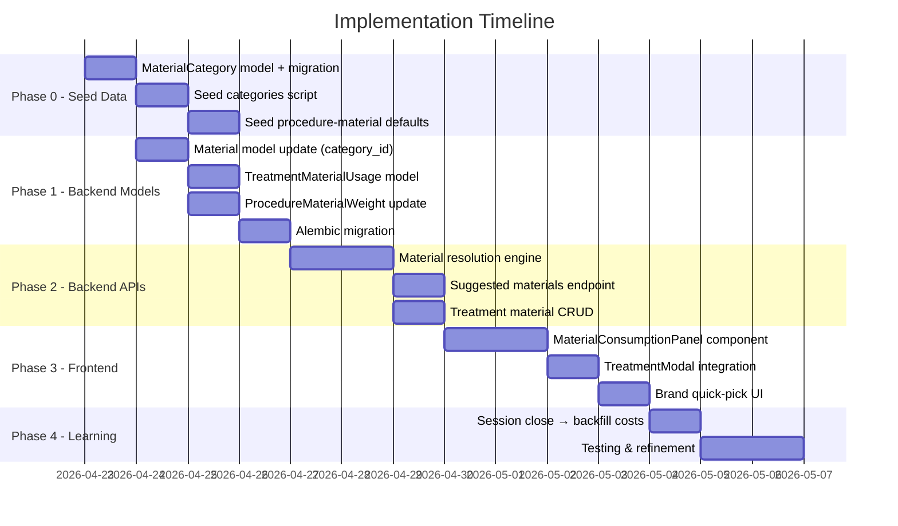

# 🏗️ Material Consumption Tracking — Implementation Plan

> **قرارات المستخدم:** (C) سعر يدوي + تسجيل المادة فقط | Session يقفلها الدكتور | ممكن أكتر من session مفتوحة | الأولوية: Material Tracking أولاً

---

## Phase 0: Default Material Categories & Procedure-Material Mapping (Seed Data)

### Material Categories (Global — `tenant_id = NULL`)

| # | Category (EN) | Category (AR) | Type | Base Unit | Notes |
|---|--------------|---------------|------|-----------|-------|
| 1 | Composite Resin | كمبوزيت | DIVISIBLE | g | أساسي للحشوات |
| 2 | Dental Adhesive/Bonding | بوندينج | DIVISIBLE | ml | لاصق الحشو |
| 3 | Acid Etchant | حامض إتشانت | DIVISIBLE | ml | فوسفوريك أسيد |
| 4 | Amalgam | أملجم | DIVISIBLE | g | حشو أملجم |
| 5 | Temporary Filling Material | حشو مؤقت | DIVISIBLE | g | IRM / Cavit |
| 6 | Glass Ionomer Cement | جلاس أيونومر | DIVISIBLE | g | GIC |
| 7 | Anesthetic Cartridge | بنج | NON_DIVISIBLE | cartridge | 1.8ml per cartridge |
| 8 | Anesthetic Needle | إبرة بنج | NON_DIVISIBLE | piece | single use |
| 9 | Gutta Percha Points | جوتابيركا | NON_DIVISIBLE | piece | obturation |
| 10 | Endodontic Files | أبر عصب | NON_DIVISIBLE | piece | H/K files |
| 11 | Root Canal Sealer | سيلر حشو عصب | DIVISIBLE | g | AH Plus etc |
| 12 | Sodium Hypochlorite | هايبوكلوريت | DIVISIBLE | ml | irrigation |
| 13 | EDTA Solution | EDTA | DIVISIBLE | ml | smear layer removal |
| 14 | Paper Points | بيبر بوينت | NON_DIVISIBLE | piece | canal drying |
| 15 | Suture Material | خيط جراحي | NON_DIVISIBLE | piece | per packet |
| 16 | Surgical Gauze | شاش جراحي | NON_DIVISIBLE | piece | hemostasis |
| 17 | Hemostatic Agent | مادة مرقئة | NON_DIVISIBLE | piece | gelfoam etc |
| 18 | Impression Material (Alginate) | ألجينات | DIVISIBLE | g | preliminary |
| 19 | Impression Material (Silicone) | سيليكون طبعة | DIVISIBLE | ml | PVS final |
| 20 | Temporary Cement | أسمنت مؤقت | DIVISIBLE | g | ZOE / TempBond |
| 21 | Permanent Cement | أسمنت دائم | DIVISIBLE | g | RelyX etc |
| 22 | Polishing Paste | بيست تلميع | DIVISIBLE | g | polishing |
| 23 | Polishing Cup/Brush | فرشاة تلميع | NON_DIVISIBLE | piece | single use |
| 24 | Fluoride Varnish | فلورايد | DIVISIBLE | ml | topical |
| 25 | Rubber Dam | رابر دام | NON_DIVISIBLE | piece | isolation |
| 26 | Cotton Rolls | قطن رول | NON_DIVISIBLE | piece | isolation |
| 27 | Fiber Post | فايبر بوست | NON_DIVISIBLE | piece | post & core |
| 28 | Core Buildup Material | مادة بناء اللب | DIVISIBLE | g | composite core |

---

### Procedure → Material Defaults (with Relative Weights)

> **Weight System:** `1.0` = baseline consumption. Higher = more material used.
> These are **estimates** that the learning system will refine over time.

#### 🔹 Composite Fillings

| Procedure | Material Category | Weight | Est. Usage | Notes |
|-----------|------------------|--------|------------|-------|
| **Composite Filling Class I** | Composite Resin | 1.0 | ~0.03g | Small, 1 surface |
| | Dental Adhesive | 1.0 | ~0.05ml | Standard bond |
| | Acid Etchant | 1.0 | ~0.05ml | Standard etch |
| | Anesthetic Cartridge | 1.0 | 1 cartridge | |
| | Anesthetic Needle | 1.0 | 1 piece | |
| **Composite Filling Class II** | Composite Resin | 1.5 | ~0.05g | 2 surfaces, larger |
| | Dental Adhesive | 1.0 | ~0.05ml | |
| | Acid Etchant | 1.0 | ~0.05ml | |
| | Anesthetic Cartridge | 1.0 | 1 cartridge | |
| | Anesthetic Needle | 1.0 | 1 piece | |
| **Composite Filling Class III** | Composite Resin | 0.8 | ~0.02g | Anterior, smaller |
| | Dental Adhesive | 1.0 | ~0.05ml | |
| | Acid Etchant | 1.0 | ~0.05ml | |
| | Anesthetic Cartridge | 1.0 | 1 cartridge | |
| **Composite Filling Class IV** | Composite Resin | 1.8 | ~0.05g | Anterior, incisal |
| | Dental Adhesive | 1.0 | ~0.05ml | |
| | Acid Etchant | 1.0 | ~0.05ml | |
| | Anesthetic Cartridge | 1.0 | 1 cartridge | |
| **Composite Filling Class V** | Composite Resin | 0.7 | ~0.02g | Cervical, smallest |
| | Dental Adhesive | 1.0 | ~0.05ml | |
| | Acid Etchant | 1.0 | ~0.05ml | |
| | Anesthetic Cartridge | 1.0 | 1 cartridge | |
| **Anterior Aesthetic Filling** | Composite Resin | 2.0 | ~0.06g | Multiple layers |
| | Dental Adhesive | 1.2 | ~0.06ml | |
| | Acid Etchant | 1.0 | ~0.05ml | |
| | Anesthetic Cartridge | 1.0 | 1 cartridge | |

#### 🔹 Amalgam Fillings

| Procedure | Material Category | Weight | Notes |
|-----------|------------------|--------|-------|
| **Amalgam Filling Class I** | Amalgam | 1.0 | Standard |
| | Anesthetic Cartridge | 1.0 | |
| **Amalgam Filling Class II** | Amalgam | 1.5 | Larger |
| | Anesthetic Cartridge | 1.0 | |

#### 🔹 Temporary & Re-fillings

| Procedure | Material Category | Weight | Notes |
|-----------|------------------|--------|-------|
| **Temporary Filling** | Temporary Filling Material | 1.0 | Cavit/IRM |
| | Anesthetic Cartridge | 0.5 | Sometimes not needed |
| **Re-filling** | Composite Resin | 1.2 | Removing old + new |
| | Dental Adhesive | 1.0 | |
| | Acid Etchant | 1.0 | |
| | Anesthetic Cartridge | 1.0 | |

#### 🔹 Endodontics (Root Canal)

| Procedure | Material Category | Weight | Notes |
|-----------|------------------|--------|-------|
| **Root Canal Treatment** | Anesthetic Cartridge | 1.5 | Often 2 cartridges |
| | Anesthetic Needle | 1.0 | |
| | Endodontic Files | 3.0 | 3-6 files per canal |
| | Sodium Hypochlorite | 2.0 | Heavy irrigation |
| | EDTA Solution | 1.0 | |
| | Paper Points | 3.0 | Multiple per canal |
| | Gutta Percha Points | 2.0 | Master + accessory |
| | Root Canal Sealer | 1.0 | |
| | Temporary Filling Material | 1.0 | Access closure |
| | Rubber Dam | 1.0 | Mandatory isolation |
| **Retreatment Root Canal** | Anesthetic Cartridge | 2.0 | Longer procedure |
| | Endodontic Files | 4.0 | More files needed |
| | Sodium Hypochlorite | 3.0 | |
| | EDTA Solution | 1.5 | |
| | Paper Points | 4.0 | |
| | Gutta Percha Points | 2.0 | |
| | Root Canal Sealer | 1.2 | |
| | Rubber Dam | 1.0 | |

#### 🔹 Extractions

| Procedure | Material Category | Weight | Notes |
|-----------|------------------|--------|-------|
| **Simple Extraction** | Anesthetic Cartridge | 1.5 | 1-2 cartridges |
| | Anesthetic Needle | 1.0 | |
| | Surgical Gauze | 2.0 | 2-4 pieces |
| **Surgical Extraction** | Anesthetic Cartridge | 2.0 | 2-3 cartridges |
| | Anesthetic Needle | 1.0 | |
| | Surgical Gauze | 3.0 | |
| | Suture Material | 1.0 | 1 pack |
| **Wisdom Tooth Extraction** | Anesthetic Cartridge | 2.5 | |
| | Surgical Gauze | 3.0 | |
| | Suture Material | 1.0 | |
| **Partially Impacted Wisdom** | Anesthetic Cartridge | 3.0 | Complex |
| | Surgical Gauze | 4.0 | |
| | Suture Material | 1.5 | |
| | Hemostatic Agent | 1.0 | |
| **Fully Impacted Wisdom** | Anesthetic Cartridge | 3.0 | Most complex |
| | Surgical Gauze | 5.0 | |
| | Suture Material | 2.0 | |
| | Hemostatic Agent | 1.5 | |
| **Primary Tooth Extraction** | Anesthetic Cartridge | 0.5 | Often topical only |
| | Surgical Gauze | 1.0 | |
| **Root Remnants Extraction** | Anesthetic Cartridge | 2.0 | |
| | Surgical Gauze | 3.0 | |
| | Suture Material | 1.0 | |

#### 🔹 Crowns & Bridges

| Procedure | Material Category | Weight | Notes |
|-----------|------------------|--------|-------|
| **Porcelain/Zirconia/E-max/Metal Crown** | Anesthetic Cartridge | 1.5 | Preparation |
| | Impression Material (Alginate) | 1.0 | Preliminary |
| | Impression Material (Silicone) | 1.0 | Final |
| | Temporary Cement | 1.0 | Temp crown |
| | Cotton Rolls | 2.0 | |
| **Temporary Crown** | Anesthetic Cartridge | 1.0 | |
| | Temporary Cement | 1.0 | |
| **Fixed Bridge** | Anesthetic Cartridge | 2.0 | Multiple preps |
| | Impression Material (Silicone) | 2.0 | Larger impression |
| | Temporary Cement | 1.5 | |
| **Crown Recementation** | Permanent Cement | 1.0 | No anesthetic usually |
| | Cotton Rolls | 1.0 | |

#### 🔹 Post & Core Buildup

| Procedure | Material Category | Weight | Notes |
|-----------|------------------|--------|-------|
| **Post and Core Buildup** | Anesthetic Cartridge | 1.0 | |
| | Fiber Post | 1.0 | 1 per canal |
| | Core Buildup Material | 1.5 | Composite core |
| | Acid Etchant | 1.0 | |
| | Dental Adhesive | 1.0 | |
| | Permanent Cement | 1.0 | Post cementation |

#### 🔹 Dentures (impression only — fabrication in lab)

| Procedure | Material Category | Weight | Notes |
|-----------|------------------|--------|-------|
| **Complete Acrylic Denture** | Impression Material (Alginate) | 3.0 | Multiple impressions |
| **Partial Acrylic Denture** | Impression Material (Alginate) | 2.0 | |
| **Partial Metal Denture** | Impression Material (Alginate) | 2.0 | |
| | Impression Material (Silicone) | 1.0 | Precision |
| **Flexible Denture** | Impression Material (Alginate) | 2.0 | |

#### 🔹 Preventive & Diagnostic

| Procedure | Material Category | Weight | Notes |
|-----------|------------------|--------|-------|
| **Scaling** | Polishing Paste | 1.0 | ~2g per patient |
| | Polishing Cup/Brush | 1.0 | 1 per patient |
| | Fluoride Varnish | 1.0 | Optional |
| **Examination** | Cotton Rolls | 1.0 | Minimal |
| **Follow-up Session** | *(varies)* | — | No default materials |

---

## Phase 1: Database Models (Backend)

### New Model: `MaterialCategory`

```python
class MaterialCategory(Base):
    __tablename__ = "material_categories"
    
    id = Column(Integer, primary_key=True, index=True)
    name_en = Column(String, nullable=False, unique=True)
    name_ar = Column(String, nullable=False)
    default_type = Column(String, default="DIVISIBLE")  # DIVISIBLE / NON_DIVISIBLE
    default_unit = Column(String, default="g")
    
    materials = relationship("Material", back_populates="category")
```

### Modified: `Material` (+2 fields)

```diff
 class Material(Base):
     # ... existing fields ...
+    category_id = Column(Integer, ForeignKey("material_categories.id"), nullable=True)
+    brand = Column(String, nullable=True)  # e.g. "3M Filtek Z350"
+    
+    category = relationship("MaterialCategory", back_populates="materials")
```

### New Model: `TreatmentMaterialUsage`

```python
class TreatmentMaterialUsage(Base):
    """Links each treatment to the materials used."""
    __tablename__ = "treatment_material_usages"
    
    id = Column(Integer, primary_key=True, index=True)
    treatment_id = Column(Integer, ForeignKey("treatments.id"), nullable=False, index=True)
    material_id = Column(Integer, ForeignKey("materials.id"), nullable=False)
    session_id = Column(Integer, ForeignKey("material_sessions.id"), nullable=True)
    
    weight_score = Column(Float, default=1.0)       # Relative weight for this procedure
    quantity_used = Column(Float, nullable=True)     # Calculated AFTER session closes (for DIVISIBLE)
    cost_calculated = Column(Float, nullable=True)   # Back-calculated cost
    
    is_manual_override = Column(Boolean, default=False)  # Doctor adjusted manually
    
    tenant_id = Column(Integer, ForeignKey("tenants.id"), nullable=False)
    created_at = Column(DateTime, default=datetime.utcnow)
    
    treatment = relationship("Treatment")
    material = relationship("Material")
    session = relationship("MaterialSession")
```

### Modified: `ProcedureMaterialWeight` (+1 field)

```diff
 class ProcedureMaterialWeight(Base):
     # ... existing fields ...
+    category_id = Column(Integer, ForeignKey("material_categories.id"), nullable=True)
+    # Now supports: specific material_id OR generic category_id
+    category = relationship("MaterialCategory")
```

---

## Phase 2: Seed Script

### `seed_material_categories.py`
- Insert 28 `MaterialCategory` records (from table above)

### `seed_procedure_material_defaults.py`
- Insert `ProcedureMaterialWeight` records with `category_id` + default `weight`
- These are **global defaults** (`tenant_id = NULL`)
- When clinic adds materials, system matches by category

---

## Phase 3: Backend APIs

### New Endpoints

| Method | Path | Purpose |
|--------|------|---------|
| `GET` | `/api/v1/material-categories` | List all global categories |
| `GET` | `/api/v1/material-categories/{id}/materials` | List clinic materials in a category |
| `GET` | `/api/v1/procedures/{id}/suggested-materials` | Get suggested materials for procedure (uses resolution engine) |
| `POST` | `/api/v1/treatments/{id}/materials` | Save material usage for a treatment |
| `GET` | `/api/v1/treatments/{id}/materials` | Get recorded materials for treatment |

### Material Resolution Engine (Updated)

```python
def resolve_materials_for_procedure(procedure_id, tenant_id, doctor_id):
    """
    1. Get default categories from ProcedureMaterialWeight (global)
    2. For each category, find clinic's material (by category_id)
    3. Check for active sessions → auto-select
    4. Return suggestions with confidence level
    """
```

---

## ❓ How Doctors Add Materials, Brands & Prices

### Current Flow (already works — just needs category + brand)

The existing [AddMaterialModal](file:///d:/DENTIX/frontend/src/features/inventory/AddMaterialModal.jsx) already lets doctors add materials. We enhance it with **just 2 new fields**:

```
┌─── Add New Material ──────────────────────────────────────────┐
│                                                               │
│  Category:  [Composite Resin            ▾]  ← NEW dropdown   │
│  Brand:     [3M Filtek Z350               ]  ← NEW field     │
│  Name:      [3M Filtek Z350 - A2          ]  (auto-filled)   │
│                                                               │
│  Type:      [DIVISIBLE ▾]     Unit: [g    ]  (auto from      │
│  Pack Size: [4.0     ] g      Alert: [10  ]   category)      │
│                                                               │
│  [Cancel]                              [Save Material]        │
└───────────────────────────────────────────────────────────────┘
```

### Price Entry (already exists in Stock Addition)

When adding stock/batch, doctor already enters `cost_per_unit`:

```
┌─── Add Stock ──────────────────────────────────────────┐
│  Material: 3M Filtek Z350 - A2                         │
│  Batch #:  [FLT-2026-001    ]                          │
│  Qty:      [5] syringes                                │
│  Cost/Unit:[150 EGP         ] ← THIS is the price!    │
│  Expiry:   [2027-06-15      ]                          │
└────────────────────────────────────────────────────────┘
```

### The Complete Doctor Journey

```
Step 1 (Once): Settings → Inventory → Add Material
  → Pick category "Composite Resin"
  → Type brand "3M Filtek Z350"
  → System auto-fills type (DIVISIBLE) and unit (g)

Step 2 (Per purchase): Inventory → Add Stock  
  → Pick material → Enter batch, qty, cost per unit
  → Cost/unit = 150 EGP per syringe (4g)
  → System calculates: 150 ÷ 4 = 37.5 EGP/g

Step 3 (Daily use): Treatment → Materials auto-suggested
  → System knows clinic has "3M Filtek" in "Composite" category
  → Auto-suggests it when doctor does a Composite Filling
```

> **No new screens needed!** Just 2 new fields (category dropdown + brand text) on the existing AddMaterialModal.

### Also: Add "Post and Core Buildup" to `seed_procedures.py`

```python
# Add to PROCEDURES_LIST in seed_procedures.py:
"بوست وبناء لب – Post and Core Buildup",
```

## Phase 4: Frontend (TreatmentModal Integration)

### Flow: When doctor selects a procedure

```
1. API call → /procedures/{id}/suggested-materials
2. Show material list (auto-populated from defaults)
3. For each material:
   - DIVISIBLE with active session → ✅ auto-linked, show weight
   - DIVISIBLE without session → ⚠️ "No open session"  
   - NON_DIVISIBLE → show qty spinner [- 1 +]
   - Multiple brands in category → radio buttons for quick pick
4. Doctor can adjust weights/quantities manually
5. On save → POST /treatments/{id}/materials
```

### UI Component: `MaterialConsumptionPanel`

Embedded inside `TreatmentModal`, shows:
- Auto-populated material list based on procedure
- Active session indicator for divisible materials
- Quick brand selector if multiple exist
- Manual override toggle
- Estimated cost (informational only)

---

## Phase 5: Learning Integration

### On Treatment Save
- Create `TreatmentMaterialUsage` records
- Link to active `MaterialSession` (if DIVISIBLE)
- For NON_DIVISIBLE: deduct stock immediately

### On Session Close (existing `close_session`)
- Already works! Uses weight scores from treatments
- **NEW**: Also updates `TreatmentMaterialUsage.quantity_used` and `cost_calculated`
- Updates `ProcedureMaterialWeight.current_average_usage`

---

## Execution Order



---

## Key Design Decisions Summary

| Question | Decision | Rationale |
|----------|----------|-----------|
| Pricing per grade? | (C) Manual — doctor sets price, system records material | أبسط وأقرب للواقع |
| Multiple sessions? | ✅ Supported | Doctor may have A2 + A3 shades open |
| Who closes session? | Doctor from app | Direct control |
| Auto vs manual material selection? | Smart auto + manual override | Active session = auto, else quick pick |
| Default consumption data? | Seeded globally, refined by learning | 28 categories × 33 procedures mapped |

> [!IMPORTANT]
> ### ⏳ Waiting for your approval
> Review the seed data tables (categories + procedure-material mapping) carefully.
> - هل في مواد ناقصة؟
> - هل الأوزان النسبية منطقية؟
> - هل في إجراءات محتاجة مواد مش مذكورة؟
> 
> **لما تقول "ابدأ" — هبدأ Phase 0 + Phase 1 فوراً.**
